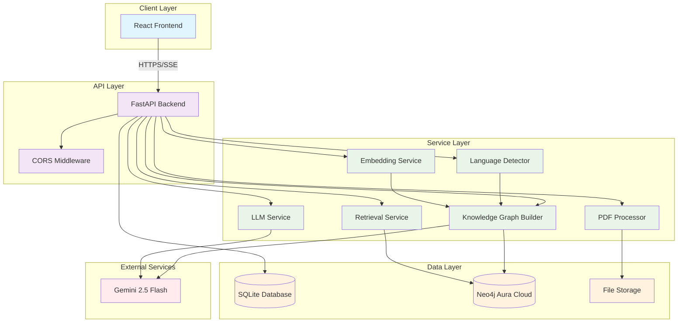
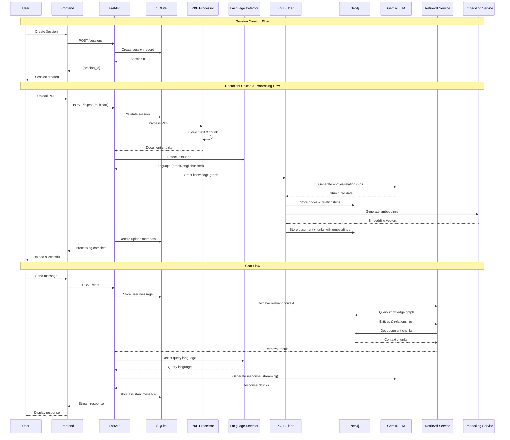
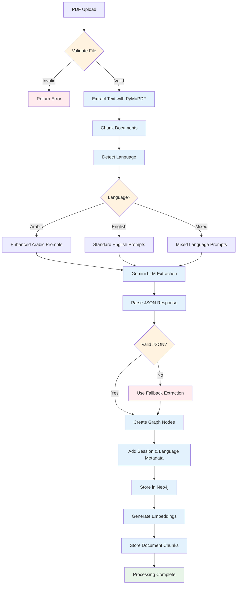
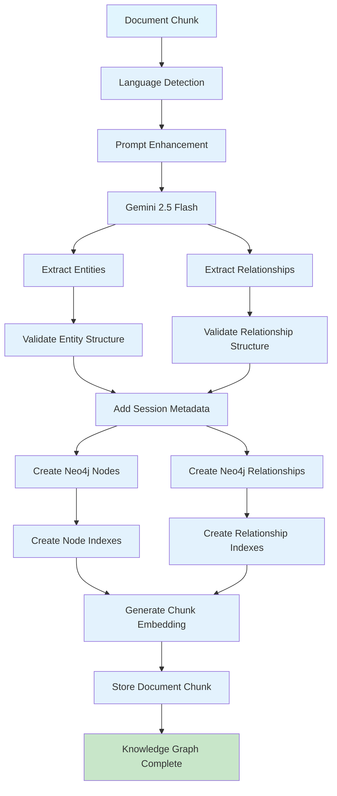
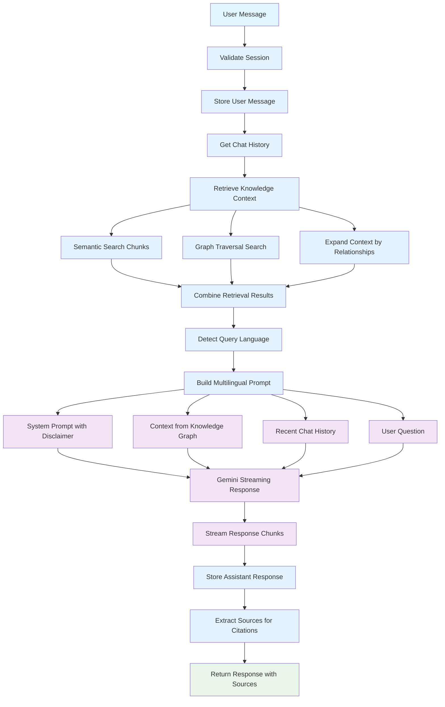

# Avokat AI - Backend and AI System Documentation

## Table of Contents
1. [System Overview](#system-overview)
2. [Architecture Components](#architecture-components)
3. [Data Flow Diagrams](#data-flow-diagrams)
4. [Backend Services](#backend-services)
5. [AI System Components](#ai-system-components)
6. [Database Architecture](#database-architecture)
7. [API Endpoints](#api-endpoints)
8. [Multilingual Support](#multilingual-support)
9. [Configuration](#configuration)
10. [Deployment](#deployment)

## System Overview

Avokat AI is a legal document analysis system that combines PDF processing, knowledge graph construction, and multilingual AI-powered chat capabilities. The system is designed to provide grounded legal assistance by analyzing uploaded documents and creating session-isolated knowledge graphs.

### Key Features
- **Session Isolation**: Each chat session maintains its own knowledge graph and document context
- **Multilingual Support**: Automatic language detection for Arabic, English, and mixed-language documents
- **Knowledge Graph**: Neo4j-based graph storage with entity and relationship extraction
- **Streaming Chat**: Real-time response generation with Server-Sent Events (SSE)
- **Document Processing**: PyMuPDF-based PDF text extraction and chunking
- **Legal Disclaimer**: Built-in legal disclaimers in all responses

## Architecture Components

### High-Level Architecture



## Data Flow Diagrams

### Complete System Data Flow



### Document Processing Pipeline



### Knowledge Graph Construction Flow



### Chat Response Generation Flow



## Backend Services

### 1. FastAPI Application (`main.py`)

The main FastAPI application orchestrates all services and provides the REST API endpoints.

**Key Features:**
- CORS middleware for cross-origin requests
- Lifespan management for service initialization
- Router inclusion for modular API structure
- Health check endpoints

**Service Initialization Order:**
1. SQLite database initialization
2. Neo4j connection establishment
3. Retrieval service setup
4. Embedding service initialization
5. LLM service configuration

### 2. Session Management (`routers/sessions.py`)

Manages chat sessions with full CRUD operations and session isolation.

**Endpoints:**
- `POST /sessions` - Create new session
- `GET /sessions` - List all sessions
- `GET /sessions/{id}` - Get specific session
- `PUT /sessions/{id}` - Update session
- `DELETE /sessions/{id}` - Delete session and all associated data

**Session Isolation:**
- Each session maintains separate knowledge graphs
- Cascade deletion removes all related data
- Neo4j data clearing on session deletion

### 3. Document Ingestion (`routers/ingest.py`)

Handles PDF upload, processing, and knowledge graph creation.

**Processing Pipeline:**
1. File validation and storage
2. PDF text extraction with PyMuPDF
3. Document chunking with configurable parameters
4. Language detection for multilingual support
5. Knowledge graph extraction with Gemini LLM
6. Neo4j storage with session isolation
7. Embedding generation and storage

**Rate Limiting:**
- 4-second delay between LLM requests
- Configurable chunk processing limits
- Error handling with graceful degradation

### 4. Chat Interface (`routers/chat.py`)

Provides streaming and non-streaming chat capabilities with knowledge graph integration.

**Features:**
- Server-Sent Events (SSE) for real-time streaming
- Non-streaming fallback option
- Chat history management
- Source extraction for citations
- Error handling with user-friendly messages

**Response Generation:**
1. Store user message in SQLite
2. Retrieve recent chat history
3. Query knowledge graph for relevant context
4. Generate response with Gemini LLM
5. Stream response chunks to client
6. Store assistant response

## AI System Components

### 1. Language Detection Service (`services/language_detector.py`)

**Purpose:** Automatic language detection for multilingual document processing.

**Supported Languages:**
- Arabic (Unicode ranges: \u0600-\u06FF, \u0750-\u077F, etc.)
- English (Latin characters)
- Mixed (combination of Arabic and English)

**Detection Algorithm:**
```python
def detect_language(self, text: str) -> str:
    arabic_chars = len(arabic_pattern.findall(text))
    english_chars = len(english_pattern.findall(text))
    total_chars = arabic_chars + english_chars
    
    arabic_ratio = arabic_chars / total_chars
    english_ratio = english_chars / total_chars
    
    if arabic_ratio > 0.3:
        return 'arabic' if english_ratio <= 0.2 else 'mixed'
    elif english_ratio > 0.5:
        return 'english'
    else:
        return 'mixed'
```

**Language-Specific Enhancements:**
- Arabic: Enhanced prompts with Arabic legal terminology
- Mixed: Preservation of both language contexts
- English: Standard processing

### 2. PDF Processing Service (`services/pdf_processor.py`)

**Technology:** PyMuPDF (fitz) for high-quality text extraction.

**Features:**
- Page-by-page text extraction
- Metadata preservation (page numbers, file info)
- Document chunking with RecursiveCharacterTextSplitter
- Error handling for corrupted PDFs

**Chunking Configuration:**
- Default chunk size: 1000 characters
- Default overlap: 100 characters
- Separators: ["\n\n", "\n", " ", ""]

### 3. Knowledge Graph Builder (`services/kg_builder.py`)

**Technology:** LangChain + Neo4j + Gemini LLM

**Entity Extraction:**
- Legal entities (persons, organizations, contracts, cases)
- Legal relationships (agreements, obligations, rights)
- Key legal concepts and terms
- Dates, amounts, and important details

**Graph Construction Process:**
1. Language-specific prompt enhancement
2. Gemini LLM-based entity extraction
3. JSON response parsing and validation
4. Neo4j node and relationship creation
5. Session and language metadata addition
6. Document chunk storage with embeddings

**Error Handling:**
- JSON parsing fallbacks
- Graceful degradation on LLM failures
- Comprehensive logging for debugging

### 4. LLM Service (`services/llm.py`)

**Model:** Gemini 2.5 Flash Lite

**Features:**
- Multilingual prompt building
- Streaming and non-streaming responses
- Context-aware response generation
- Legal disclaimer integration

**Prompt Structure:**
```
System Prompt (with disclaimer)
+ 
Context from Knowledge Graph
+ 
Recent Chat History
+ 
User Question
```

**Language-Specific Enhancements:**
- Arabic: Cultural and legal context awareness
- Mixed: Preservation of both language contexts
- English: Standard legal assistance

### 5. Retrieval Service (`services/retrieval.py`)

**Purpose:** Enhanced knowledge graph querying with multilingual support.

**Retrieval Strategy:**
1. **Semantic Search:** Retrieve all document chunks for comprehensive context
2. **Graph Traversal:** Search entities and relationships based on query terms
3. **Context Expansion:** Follow relationships to find connected entities
4. **Language Filtering:** Support for language-specific queries

**Search Features:**
- Meaningful term extraction with Arabic compound word handling
- Comprehensive Cypher queries across all node properties
- Relevance scoring based on content type
- Relationship traversal for context expansion

### 6. Embedding Service (`services/embedding_service.py`)

**Technology:** Sentence Transformers with fallback options

**Models (in order of preference):**
1. `paraphrase-MiniLM-L6-v2` (384 dimensions)
2. `distilbert-base-nli-mean-tokens` (768 dimensions)
3. `all-mpnet-base-v2` (768 dimensions)
4. `all-MiniLM-L12-v2` (384 dimensions)

**Fallback Strategy:**
- Simple local embedding using word hashing
- Fixed 100-dimensional vectors
- Basic text processing for reliability

**Features:**
- Batch embedding generation
- Cosine similarity computation
- Text cleaning and normalization
- Embedding serialization for storage

## Database Architecture

### SQLite Database (`db/sqlite.py`)

**Tables:**
- `sessions`: Chat session metadata
- `messages`: Chat history with token counts
- `uploads`: File upload records

**Features:**
- WAL mode for better concurrency
- Async SQLAlchemy integration
- Automatic timestamp management
- Cascade deletion for data integrity

### Neo4j Knowledge Graph (`db/neo4j.py`)

**Node Types:**
- `Entity`: Legal entities with properties
- `Fact`: Legal facts and evidence
- `Document`: Document metadata
- `LegalConcept`: Legal terms and concepts
- `Case`: Legal cases and proceedings
- `DocumentChunk`: Text chunks with embeddings

**Relationship Types:**
- `ABOUT`: Facts about entities
- `CONTAINS`: Documents containing facts
- `MENTIONS`: Documents mentioning entities
- `RELATED_TO`: Entity relationships
- `APPLIES_TO`: Legal concepts applying to entities
- `INVOLVES`: Cases involving entities

**Indexes:**
- Session isolation indexes on all node types
- Language-specific indexes for multilingual support
- Entity type and relationship type indexes
- Performance optimization indexes

**Session Isolation:**
- All nodes and relationships tagged with `session_id`
- All queries filtered by session ID
- Automatic cleanup on session deletion

## API Endpoints

### Session Management
```
POST   /sessions                    # Create session
GET    /sessions                   # List sessions
GET    /sessions/{id}              # Get session
PUT    /sessions/{id}              # Update session
DELETE /sessions/{id}              # Delete session
GET    /sessions/{id}/messages     # Get session messages
GET    /sessions/{id}/uploads      # Get session uploads
GET    /sessions/{id}/full         # Get complete session data
```

### Document Processing
```
POST   /ingest                     # Upload and process PDF
```

### Chat Interface
```
POST   /chat                       # Streaming chat
POST   /chat/non-streaming         # Non-streaming chat
GET    /chat/history/{session_id}  # Get chat history
```

### Neo4j Operations
```
POST   /neo4j/query                # Execute Cypher query
GET    /neo4j/stats/{session_id}   # Get session statistics
```

## Multilingual Support

### Language Detection
- Automatic detection using Unicode character analysis
- Support for Arabic, English, and mixed-language content
- Language-specific prompt enhancements

### Arabic Language Features
- Enhanced prompts with Arabic legal terminology
- Cultural context awareness
- Right-to-left text handling considerations
- Arabic compound word mapping

### Mixed Language Support
- Preservation of original language in entities
- Cross-language relationship detection
- Language-specific indexing for efficient queries

### Language-Specific Processing
- Arabic documents receive enhanced prompts
- English documents use standard processing
- Mixed-language documents maintain both contexts

## Configuration

### Environment Variables
```bash
# Database Configuration
DATABASE_URL=sqlite+aiosqlite:///./avokat.db
NEO4J_URI=neo4j+s://your-instance.databases.neo4j.io
NEO4J_USERNAME=neo4j
NEO4J_PASSWORD=your-password
NEO4J_DATABASE=neo4j

# AI Services
GEMINI_API_KEY=your-gemini-api-key

# API Configuration
API_TITLE=Avokat AI API
API_VERSION=1.0.0
DEBUG=false
```

### Service Configuration
- **PDF Processing:** Configurable chunk size and overlap
- **LLM Service:** Rate limiting and error handling
- **Embedding Service:** Model selection and fallback options
- **Retrieval Service:** Search limits and language filtering

## Deployment

### Prerequisites
- Python 3.8+
- Neo4j Aura Cloud instance
- Gemini API key
- PyMuPDF installation

### Setup Steps
1. **Environment Setup:**
   ```bash
   py -m venv venv
   venv\Scripts\Activate.ps1
   pip install -r requirements.txt
   ```

2. **Configuration:**
   - Set environment variables
   - Configure Neo4j Aura connection
   - Set Gemini API key

3. **Database Initialization:**
   - SQLite tables created automatically
   - Neo4j indexes created on startup

4. **Service Startup:**
   ```bash
   uvicorn backend.app.main:app --host 0.0.0.0 --port 8000
   ```

### Health Checks
- `/health` endpoint for service status
- Database connectivity verification
- External service availability checks

### Monitoring
- Comprehensive logging throughout the system
- Error tracking and graceful degradation
- Performance metrics for key operations

---

This documentation provides a comprehensive overview of the Avokat AI backend and AI system architecture. The system is designed for scalability, multilingual support, and robust error handling while maintaining session isolation and legal compliance through built-in disclaimers.
