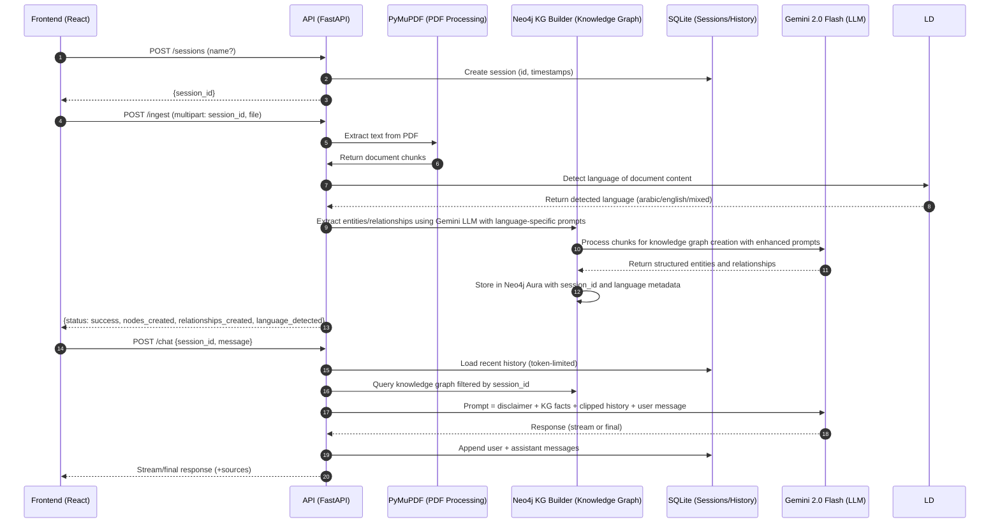
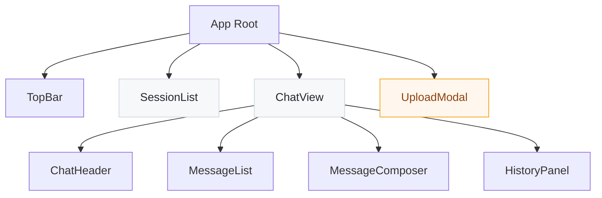
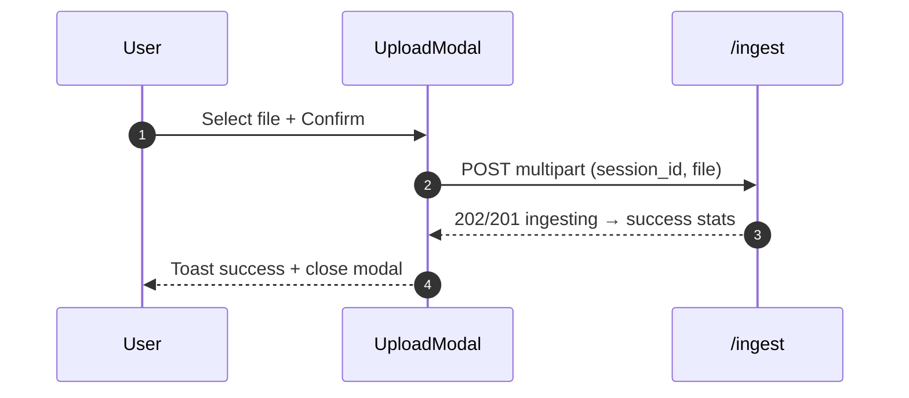
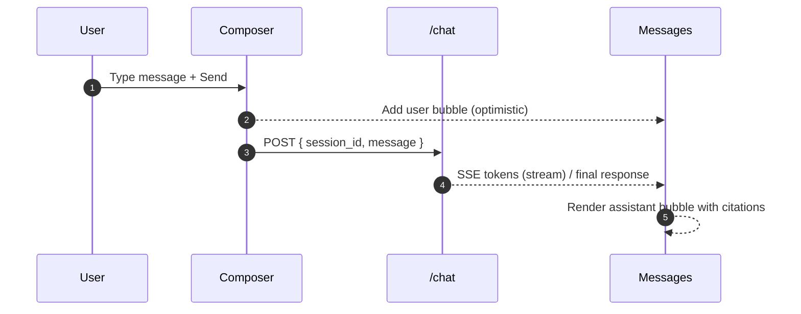

## Legal Chatbot MVP – Full Documentation Plan (PyMuPDF + Neo4j Knowledge Graph Builder)

### 1. Objectives and Scope
- **Primary goals**:
  - **Per-chat isolation**: Each chat session uses only its own uploaded documents; no cross-session leakage.
  - **Grounded answers**: Retrieval-augmented responses using session-scoped knowledge and recent chat history.
  - **Multilingual support**: Automatic language detection and processing for Arabic, English, and mixed-language documents.
  - **Safety**: Prominent disclaimer in UI and in every model response: "This is not legal advice."
  - **Simplicity**: Single-user assumption; 1–2 PDFs per session; minimal UI; shippable in 1 day.
- **Non-goals (MVP)**:
  - Multi-user auth/roles/ACLs; enterprise SSO.
  - Cross-session search, merges, or content sharing.
  - Production observability (full tracing/metrics), rate limiting, or advanced security hardening.

### 2. Architecture Overview
- **Frontend (React)**: Session creation/selection, per-session file upload, chat UI with citations and history.
- **Backend (FastAPI)**: Session management, ingestion, retrieval, LLM calls, history persistence, isolation enforcement.
- **PDF Processing (PyMuPDF)**: High-quality PDF text extraction and document processing.
- **Language Detection**: Automatic language detection using `langdetect` library for Arabic, English, and mixed-language content.
- **Knowledge Graph (Neo4j Knowledge Graph Builder + LangChain)**: Session-scoped entities and relationships extracted using Gemini LLM with language-specific prompts.
- **Persistence**: SQLite for sessions/messages/uploads; Neo4j Aura Cloud for KG; both keyed by `session_id` with language metadata.
- **LLM (Gemini 2.0 Flash)**: Knowledge graph extraction and answer synthesis (low temperature, deterministic, with disclaimer) with multilingual prompt enhancement.

#### 2.1 Data Flow (High Level)


#### 2.2 Context and Components
```mermaid
graph TD
    subgraph Client
        UI[React Frontend]
    end
    subgraph Server
        API[FastAPI Backend]
        PDF[PyMuPDF Processor]
        LD[Language Detector]
        KG[Neo4j KG Builder + LangChain]
        DB[SQLite]
        LLM[Gemini 2.0 Flash]
    end

    UI -->|HTTPS JSON/SSE| API
    API -->|PDF Processing| PDF
    PDF -->|Document Chunks| LD
    LD -->|Language Detection| KG
    KG -->|Entities/Relationships (session_id + language)| Neo4j[(Neo4j Aura Cloud)]
    API -->|History CRUD| DB
    API -->|Prompt/Response| LLM
    KG -->|Knowledge Graph Extraction| LLM
```

### 3. Storage, Data Model, and Isolation
- **Global principle**: All KG entities and edges carry `session_id` and `language` metadata. Every query and write is scoped by `session_id`.

#### 3.1 SQLite (sessions, messages, uploads)
- **Tables**:
  - `sessions(id, name, created_at, updated_at)`
  - `messages(id, session_id, role, content, token_count, created_at)`
  - `uploads(id, session_id, file_name, size_bytes, created_at)`
- **Settings**: WAL enabled; index on `messages.session_id` for fast history retrieval.
- **History policy**: Maintain token counts to clip history by token budget, not message count.

#### 3.2 Neo4j (Knowledge Graph Builder-backed KG)
- **Isolation**: Add `session_id` and `language` properties to all nodes and relationships. All Cypher includes `WHERE ... session_id = $session_id`.
- **Multilingual indices**: Create language-specific indices for all node types (Entity, Fact, Document, LegalConcept, Case) to enable efficient language-based queries.
- **Language metadata**: All entities and relationships are tagged with detected language (arabic, english, mixed) for multilingual knowledge graph exploration.
- **Temporal metadata**: Set `created_at` timestamp when creating entities to enable time-aware queries later (optional for MVP).
- **Startup tasks**: On backend startup, initialize Neo4j connection and verify indices/constraints including multilingual language indices.

### 4. Knowledge Graph Pipeline

#### 4.1 Ingestion (PyMuPDF + Language Detection + Neo4j Knowledge Graph Builder)
- **PDF Processing**: Use PyMuPDF for high-quality text extraction from uploaded PDF files.
- **Language Detection**: Automatically detect document language using `langdetect` library (supports Arabic, English, mixed-language detection).
- **Chunking**: Recursive character splitter with moderate chunk size and small overlap (optimize for entity extraction).
- **Multilingual Knowledge Graph Extraction**: Use Gemini 2.0 Flash LLM with language-specific prompts to extract:
  - Legal entities (persons, organizations, contracts, cases, laws, regulations)
  - Legal relationships (agreements, obligations, rights, responsibilities)
  - Key legal concepts and terms
  - Dates, amounts, and other important details
- **Language-Specific Prompt Enhancement**: Arabic content receives enhanced prompts with Arabic legal terminology guidance.
- **Mapping to KG**: Convert extracted entities and relationships to Neo4j nodes and edges with citations (doc name, section), attach `session_id`, `language`, and `created_at` timestamp.
- **Idempotency**: Upserts keyed by `entity_id` + `session_id` to avoid duplicates.

#### 4.2 Retrieval (Multilingual Knowledge Graph-based)
- **Scope first**: Enforce `session_id` filtering in all Neo4j queries using Cypher WHERE clauses.
- **Language-aware retrieval**: Query entities and relationships filtered by detected language for multilingual context.
- **Entity-based retrieval**: Query relevant entities and their relationships based on user questions.
- **Relationship traversal**: Follow relationship paths to find connected entities and context.
- **Multilingual context pack**: Build a compact set of entities, relationships, and properties + citations for prompt augmentation, maintaining language context.

#### 4.3 Prompting (Multilingual Gemini 2.5 Flash)
- **System instruction**: The assistant must use only session knowledge graph context and recent chat history and a system prompt that he is a professional legal assistant; .
- **Multilingual prompt structure** (token-aware):
  - Disclaimer (fixed)
  - Session KG entities and relationships (structured, concise, with citations and language context)
  - Recent chat history (role-labeled, clipped by tokens)
  - User message
- **Language-specific enhancements**: Arabic content receives enhanced prompts with Arabic legal terminology and cultural context.
- **Parameters**: Low temperature (0.1); conservative safety settings as available.

### 5. Multilingual Support Features

#### 5.1 Language Detection
- **Automatic Detection**: Uses `langdetect` library to automatically identify document language (Arabic, English, mixed).
- **Chunk-level Detection**: Language is detected for each document chunk to handle mixed-language documents.
- **Fallback Handling**: Defaults to English if language detection fails or is uncertain.

#### 5.2 Language-Specific Processing
- **Arabic Enhancement**: Arabic content receives enhanced prompts with:
  - Arabic legal terminology guidance
  - Cultural context awareness
  - Right-to-left text handling considerations
- **English Processing**: Standard English legal document processing.
- **Mixed Language**: Documents with both Arabic and English content are processed with mixed-language context.

#### 5.3 Multilingual Knowledge Graph Storage
- **Language Tagging**: All entities and relationships are tagged with detected language.
- **Language Indices**: Neo4j indices created for efficient language-based queries:
  - `entity_language_idx` for Entity nodes
  - `fact_language_idx` for Fact nodes
  - `document_language_idx` for Document nodes
  - `legalconcept_language_idx` for LegalConcept nodes
  - `case_language_idx` for Case nodes

#### 5.4 Multilingual Query Support
- **Language Filtering**: All Neo4j queries can filter by language for multilingual exploration.
- **Cross-language Relationships**: Support for relationships between entities of different languages.
- **Language Statistics**: Track and report language distribution in knowledge graphs.

### 6. API Design and Contracts

#### 6.1 Endpoints
- **POST `/sessions`**
  - Body: optional `name`
  - Response: `session_id`
- **POST `/ingest`**
  - Multipart: `session_id`, `file`
  - Validates file type/size; runs PDF processing, language detection, and multilingual knowledge graph extraction; persists upload metadata
  - Response: `status`, ingestion stats (e.g., nodes_created, relationships_created count, language_detected)
- **POST `/chat`**
  - Body: `session_id`, `message`
  - Behavior: load recent history (token-limited), retrieve KG entities/relationships (scoped), call LLM, append messages
  - Response: streaming text or final `{response, sources}` with citations
- **GET `/history/{session_id}`**: Returns ordered messages.
- **GET `/history/list`**: Returns `{id, name, last_updated}` for all sessions.

#### 6.2 Errors
- 400: missing/invalid fields; invalid file type/size.
- 404: session not found.
- 409: optional duplicate upload conflict.
- 500: ingestion/LLM errors (return friendly message; log diagnostics).

#### 6.3 Streaming
- **Preferred**: Server-Sent Events (SSE) for incremental tokens.
- **Fallback**: Poll for final response if SSE is not feasible on Day‑1.

### 7. Frontend (React) Specification

#### 7.1 Views and Components
- **SessionList**: Create new session; select existing sessions.
- **ChatView**: Header shows current session; messages list; input box; citations under assistant replies.
- **UploadModal**: Upload documents to the current session.
- **HistoryPanel**: Collapsible; shows prior messages with timestamps.

#### 7.2 State and Integration
- Maintain `session_id` in app state (persist in localStorage for resume).
- On session switch: load history and show upload stats.
- Chat submission: add optimistic user message; stream or show loading until assistant reply completes.

#### 7.3 UX
- Show session badge to avoid confusion.
- Disable chat input until at least one document ingested; show guidance to upload.
- Toasts for upload/ingestion status and errors.

#### 7.4 Component Tree and Responsibilities


- **App Root**: Holds global state (current `session_id`, cached sessions, messages, uploads, UI flags). Persists `session_id` in localStorage for resume.
- **TopBar**: Shows product name and global disclaimer (always visible).
- **SessionList**: Displays sessions with name and `last_updated`; actions: New Session, Select Session (loads history and uploads), optional delete/rename.
- **ChatView**: Main workspace for active session.
  - **ChatHeader**: Session name/badge; Upload button (opens `UploadModal`); small info on uploaded files count.
  - **MessageList**: Renders user/assistant bubbles; assistant messages show citations list (collapsible per message).
  - **MessageComposer**: Multiline input with send button; disabled until documents are ingested; shows token/char limit feedback.
  - **HistoryPanel**: Optional side drawer with chronological messages and quick navigation; can be hidden on small screens.
- **UploadModal**: File input (accept PDF/text). Shows validation, upload progress, and ingestion result summary.

#### 7.5 Detailed Screen States and Behaviors
- **SessionList**
  - Empty state: “No sessions yet. Create a new chat to begin.”
  - Card/list entries: name, last updated, files count, messages count.
  - Actions: New Session (creates and selects); Select (loads history); optional Delete (danger/confirm).

- **ChatView**
  - Empty state (no uploads): Info banner with CTA “Upload documents to this session to enable grounded answers.” Composer disabled.
  - Ready state (after ingestion): Composer enabled; header shows file count; MessageList shows history if any.
  - Streaming state: Assistant bubble reserves space and appends tokens incrementally; show typing indicator.
  - Error state: Non-blocking alert at top of ChatView; composer remains enabled unless error is fatal.

- **UploadModal**
  - Validates MIME and file size before POST.
  - Progress bar for upload; then “Processing/ingesting…” step with spinner.
  - Success summary: nodes/facts ingested; Close returns to ChatView with updated state.
  - Failure: Show error details and retry option.

- **Message rendering**
  - Assistant messages display citations (document, section/page). Citations are clickable and collapsible per message.
  - Long content is clamped with “Show more.” Keyboard accessible toggles.

#### 7.6 State Management
- **Global state shape (conceptual)**
  - `currentSessionId: string | null`
  - `sessions: Array<{ id, name, lastUpdated }>` (lazy-loaded)
  - `messagesBySession: Map<session_id, Array<{ id, role, content, createdAt, sources? }>>`
  - `uploadsBySession: Map<session_id, Array<{ id, fileName, sizeBytes, createdAt }>>`
  - `ui: { isUploading: boolean, isStreaming: boolean, error?: string }`
- **Persistence**: Store only `currentSessionId` in localStorage; cache lists in memory.
- **History loading**: On session select, fetch recent history and merge into `messagesBySession`.

#### 7.7 Networking and Integration
- **Base URL**: Use relative API URLs for all calls [[memory:8655365]].
- **Sessions**
  - POST `/sessions` → select returned `session_id` and persist.
  - GET `/history/list` to populate SessionList (optional for MVP; can build list manually in memory as sessions are created).
- **Ingestion**
  - POST `/ingest` (multipart): include `session_id` and `file`.
  - On success: update `uploadsBySession` and enable composer; show toast.
- **Chat**
  - POST `/chat`: body `{ session_id, message }`.
  - Streaming (SSE) recommended: append tokens to the in-flight assistant bubble; fallback to non-streaming request/response if SSE unsupported.
  - On completion: persist assistant message with `sources`.
- **Error mapping**: 400/404 errors show user-friendly messages (“Invalid file,” “Session not found”); 500 shows fallback guidance.

#### 7.8 Streaming UX (SSE) and Fallback
- **SSE**
  - On send: create a placeholder assistant bubble.
  - On each event: append content; keep scroll pinned to bottom unless the user scrolled up.
  - Heartbeat/keepalive messages ignored; handle stream end and error events.
- **Fallback**
  - If SSE not available, display a spinner and poll (or use non-streaming endpoint) until completion.

#### 7.9 Accessibility and Keyboard Support
- Keyboard
  - Enter to send; Shift+Enter for newline.
  - Escape to close `UploadModal`.
  - Tab order: SessionList → ChatHeader → MessageList → Composer.
- ARIA
  - Assign roles/labels to modal, lists, and buttons; use `aria-expanded` for citation toggles.
  - Respect “Reduce Motion” preference; avoid aggressive auto-scrolling.

#### 7.10 Responsiveness
- Breakpoints: 
  - Mobile: stacked layout; HistoryPanel hidden by default; modal is full-screen.
  - Tablet: collapsible SessionList; ChatView takes majority width.
  - Desktop: 3‑pane feel (SessionList, ChatView, optional HistoryPanel).

#### 7.11 Visual and Content Guidelines
- Display the legal disclaimer in the header and before the first assistant response in each session.
- Use clear, muted styling for citations; provide copy-to-clipboard for citation entries.
- Provide consistent empty state illustrations/text to guide users.

#### 7.12 UI Flows (Mermaid)
Upload Flow


Chat Flow



### 8. Configuration, Security, and Logging
- **Configuration (env)**: Neo4j Aura Cloud URI/user/pass; Gemini API key; SQLite path.
- **Security**: Never expose secrets to frontend; validate file types and sizes; limit message length.
- **CORS**: Restrict to local/frontend origin during MVP.
- **Logging**: Log request IDs, `session_id`, timings; do not log document content. For Neo4j driver calls, explicitly set the target database for efficiency and determinism.

### 9. Setup and Operations (Day‑1)
- **Prerequisites**: Neo4j Aura Cloud instance with credentials; internet for Gemini LLM API.
- **Environment**: Set required variables for backend services and providers.
- **Virtual environment**: On Windows, create with "py -m venv venv" and activate with "venv\Scripts\Activate.ps1".
- **Dependencies**: Install PyMuPDF, LangChain, Google Generative AI, Neo4j driver.
- **Startup order**: Backend (connects to Neo4j Aura) → Frontend.
- **Sanity checks**: Create session; upload a small PDF; knowledge graph extraction returns stats; ask a question; verify citations.

### 10. Testing and Validation
- **Isolation test**: Two sessions with different PDFs; ensure answers only cite the active session's knowledge graph.
- **No-doc test**: Chat without uploads yields a helpful prompt to upload first; no hallucinated content.
- **Follow-up coherence**: Multi-turn dialog where the second question references the first answer; verify continuity.
- **Citations**: Validate that cited docs/sections correspond to retrieved knowledge graph entities.
- **Performance**: Knowledge graph extraction ≤ ~60s for a 10–20 page PDF; chat p50 ≤ ~5s (short prompts).
- **Entity extraction**: Verify that legal entities (persons, organizations, contracts) are correctly identified and stored.
- **Multilingual testing**: 
  - Arabic document processing with proper language detection and enhanced prompts
  - English document processing with standard prompts
  - Mixed-language document handling with appropriate language tagging
  - Language-specific knowledge graph queries and filtering
  - Cross-language relationship detection and storage

### 11. KPIs and Acceptance Criteria
- **Functional**: ≥90% answers include correct citations; 0 cross-session leakage in tests; coherent follow-ups ≥80%.
- **Performance**: Knowledge graph extraction and chat latency targets met for small PDFs and short prompts.
- **Reliability**: Error rate ≤2% over a small demo load (knowledge graph extraction+chat).
- **Entity accuracy**: ≥85% of legal entities correctly identified and properly typed.
- **Multilingual accuracy**: ≥90% language detection accuracy for Arabic, English, and mixed-language documents.
- **Language-specific processing**: Arabic documents receive enhanced prompts and proper cultural context handling.

### 12. Risks and Fallbacks
- **PDF parsing quality**: PyMuPDF provides high-quality extraction; if issues arise, pre-convert PDFs to text before processing.
- **Knowledge graph extraction**: If Gemini LLM fails, fallback to simple text chunking and keyword-based entity extraction.
- **Neo4j connectivity**: If Neo4j Aura is unavailable, fallback to local Neo4j instance or SQLite-based storage.
- **Streaming complexity**: If SSE is unstable, use non-streaming responses for MVP while preserving the endpoint.
- **Language detection failures**: If language detection fails, default to English processing with standard prompts.
- **Multilingual processing**: If Arabic-specific processing fails, fallback to standard English processing for all content.

### 13. Operational Playbook
- **Daily ops**: Keep PDFs small for demos; rotate logs; monitor basic timings.
- **Troubleshooting**:
  - Knowledge graph extraction failures → check file type/size; Gemini API credentials; chunking parameters.
  - Slow retrieval → verify Neo4j indices; optimize Cypher queries; reduce chunk size.
  - Cross-session leakage → audit all queries for `session_id` filters.
  - LLM errors → verify Gemini API credentials/model; reduce token load by trimming entities/relationships.
  - Language detection issues → verify `langdetect` library installation; check document encoding; test with known language samples.
  - Multilingual processing failures → verify language-specific prompts; check Neo4j language indices; test with Arabic/English samples.

### 14. Delivery Checklist
- **Backend**: Env documented; Neo4j Aura connection verified; `session_id` filters in all KG queries; consistent errors; prompt contains disclaimer.
- **Frontend**: New Chat flow; per-session uploads; chat with citations; visible disclaimer; streaming or polling implemented.
- **Knowledge Graph/Storage**: PyMuPDF processing configured; Neo4j Knowledge Graph Builder with Gemini LLM; Neo4j indices verified; SQLite in WAL mode.
- **Multilingual Support**: Language detection configured; Arabic-specific prompts implemented; Neo4j language indices created; multilingual testing validated.
- **Tests**: Isolation, no-doc, follow-up, citation accuracy, entity extraction, and multilingual processing validated.

### 15. Roadmap (Post-MVP)
- Multi-user auth and per-user isolation.
- Enhanced entity/relation extraction with specialized legal models.
- Document versioning and session merge/export.
- Advanced knowledge graph queries and reasoning.
- Observability (metrics, tracing) and safety evaluations.
- **Enhanced Multilingual Support**:
  - Additional language support (French, Spanish, German, etc.)
  - Advanced language-specific legal terminology databases
  - Cross-language entity matching and translation
  - Multilingual document comparison and analysis
  - Language-specific legal citation formats and standards


