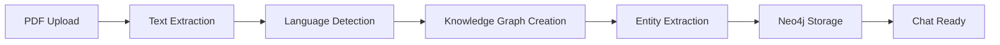
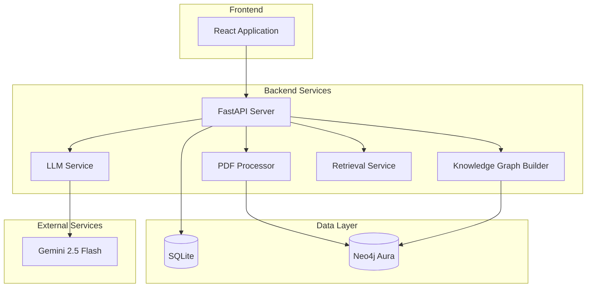

# 🏛️ Avokat AI - Legal Document Analysis System

<div align="center">


**AI-powered legal document analysis with multilingual support and knowledge graph construction**

[🚀 Quick Start](#-quick-start) • [📖 Documentation](#-documentation) • [🔧 Features](#-features) • [🏗️ Architecture](#️-architecture) • [📋 API Reference](#-api-reference)

</div>

---

## 🌟 Overview

Avokat AI is an intelligent legal document analysis system that combines advanced PDF processing, knowledge graph construction, and multilingual AI-powered chat capabilities. Built for legal professionals, it provides grounded legal assistance by analyzing uploaded documents and creating session-isolated knowledge graphs.

### 🎯 Key Capabilities

- **📄 PDF Processing**: High-quality text extraction using PyMuPDF
- **🧠 Knowledge Graph**: Neo4j-based entity and relationship extraction
- **🌍 Multilingual Support**: Arabic, English, and mixed-language processing
- **💬 AI Chat**: Real-time streaming responses with Gemini 2.5 Flash
- **🔒 Session Isolation**: Complete data separation between chat sessions
- **⚖️ Legal Compliance**: Built-in disclaimers and professional legal assistance

---

## 🚀 Quick Start

### Prerequisites

- **Python 3.8+**
- **Neo4j Aura Cloud** account
- **Google Gemini API** key
- **Git**

### Installation

1. **Clone the repository**
   ```bash
   git clone https://github.com/yourusername/avokat-ai.git
   cd avokat-ai
   ```

2. **Create virtual environment**
   ```bash
   # Windows
   py -m venv venv
   venv\Scripts\Activate.ps1
   
   # macOS/Linux
   python3 -m venv venv
   source venv/bin/activate
   ```

3. **Install dependencies**
   ```bash
   pip install -r requirements.txt
   ```

4. **Configure environment**
   ```bash
   # Copy example environment file
   cp .env.example .env
   
   # Edit .env with your credentials
   nano .env
   ```

5. **Set up Neo4j Aura**
   - Create a Neo4j Aura Cloud instance
   - Get your connection URI, username, and password
   - Update `.env` file with Neo4j credentials

6. **Start the backend**
   ```bash
   python -m uvicorn backend.app.main:app --reload --host 127.0.0.1 --port 8000
   ```

7. **Access the API**
   - API Documentation: http://127.0.0.1:8000/docs
   - Health Check: http://127.0.0.1:8000/health

---

## 🔧 Features

### 📊 Document Processing Pipeline



### 🌍 Multilingual Support

| Language | Features |
|----------|----------|
| **Arabic** | Enhanced prompts, cultural context, legal terminology |
| **English** | Standard processing, comprehensive legal assistance |
| **Mixed** | Dual-language preservation, cross-language relationships |

### 🧠 AI-Powered Analysis

- **Entity Extraction**: Legal entities, relationships, and concepts
- **Semantic Search**: Context-aware document retrieval
- **Streaming Responses**: Real-time chat with Server-Sent Events
- **Citation Support**: Source tracking and reference management

---

## 🏗️ Architecture

### System Overview



### Core Components

| Component | Technology | Purpose |
|-----------|------------|---------|
| **Backend** | FastAPI | REST API and service orchestration |
| **PDF Processing** | PyMuPDF | High-quality text extraction |
| **Knowledge Graph** | Neo4j + LangChain | Entity and relationship storage |
| **AI Engine** | Gemini 2.5 Flash | Multilingual response generation |
| **Embeddings** | Sentence Transformers | Semantic search capabilities |
| **Database** | SQLite | Session and message storage |

---

## 📋 API Reference

### Session Management

```http
POST   /sessions                    # Create new session
GET    /sessions                   # List all sessions
GET    /sessions/{id}              # Get session details
PUT    /sessions/{id}              # Update session
DELETE /sessions/{id}              # Delete session and data
```

### Document Processing

```http
POST   /ingest                     # Upload and process PDF
```

**Request:**
```bash
curl -X POST "http://localhost:8000/ingest" \
  -F "session_id=1" \
  -F "file=@document.pdf"
```

**Response:**
```json
{
  "status": "success",
  "session_id": 1,
  "file_name": "document.pdf",
  "chunks": 15,
  "nodes_created": 45,
  "relationships_created": 32,
  "session_stats": {
    "Entity": 25,
    "DocumentChunk": 15,
    "Fact": 20
  }
}
```

### Chat Interface

```http
POST   /chat                       # Streaming chat
POST   /chat/non-streaming         # Non-streaming chat
GET    /chat/history/{session_id}  # Get chat history
```

**Request:**
```bash
curl -X POST "http://localhost:8000/chat" \
  -H "Content-Type: application/json" \
  -d '{
    "session_id": 1,
    "message": "What are the key terms in this contract?"
  }'
```

**Response (Streaming):**
```
data: {"chunk": "Based on the uploaded contract, I can identify several key terms..."}

data: {"chunk": "The main parties involved are..."}

data: {"done": true, "sources": [...]}
```

---

## 🔧 Configuration

### Environment Variables

Create a `.env` file in the project root:

```bash
# Database Configuration
DATABASE_URL=sqlite+aiosqlite:///./avokat.db
NEO4J_URI=neo4j+s://your-instance.databases.neo4j.io
NEO4J_USERNAME=neo4j
NEO4J_PASSWORD=your-password
NEO4J_DATABASE=neo4j

# AI Services
GEMINI_API_KEY=your-gemini-api-key

# API Configuration
API_TITLE=Avokat AI API
API_VERSION=1.0.0
DEBUG=false
```

### Neo4j Aura Setup

1. **Create Neo4j Aura Instance**
   - Visit [Neo4j Aura](https://console.neo4j.io/)
   - Create a new database instance
   - Choose the free tier for development

2. **Get Connection Details**
   - Copy the connection URI
   - Note your username and password
   - Update your `.env` file

3. **Verify Connection**
   ```bash
   curl http://localhost:8000/health
   ```

---

## 📖 Documentation

### Comprehensive Guides

- **[Backend & AI System Documentation](Documentation/BACKEND_AI_SYSTEM_DOCUMENTATION.md)** - Complete technical reference
- **[Neo4j Aura Setup Guide](Documentation/NEO4J_AURA_SETUP.md)** - Database configuration
- **[Retrieval Improvements](Documentation/RETRIEVAL_IMPROVEMENTS.md)** - Performance optimizations
- **[Legal Chatbot MVP Plan](Documentation/LEGAL_CHATBOT_MVP_PLAN.md)** - Project specifications

### API Documentation

- **Interactive Docs**: http://localhost:8000/docs (Swagger UI)
- **ReDoc**: http://localhost:8000/redoc
- **OpenAPI Schema**: http://localhost:8000/openapi.json

---

## 🧪 Testing

### Health Checks

```bash
# Check API health
curl http://localhost:8000/health

# Test session creation
curl -X POST "http://localhost:8000/sessions" \
  -H "Content-Type: application/json" \
  -d '{"name": "Test Session"}'
```

### Sample Workflow

1. **Create Session**
   ```bash
   curl -X POST "http://localhost:8000/sessions" \
     -H "Content-Type: application/json" \
     -d '{"name": "Legal Document Analysis"}'
   ```

2. **Upload Document**
   ```bash
   curl -X POST "http://localhost:8000/ingest" \
     -F "session_id=1" \
     -F "file=@sample-contract.pdf"
   ```

3. **Start Chat**
   ```bash
   curl -X POST "http://localhost:8000/chat" \
     -H "Content-Type: application/json" \
     -d '{
       "session_id": 1,
       "message": "Summarize the key points of this contract"
     }'
   ```

---

## 🚀 Deployment

### Development

```bash
# Start with auto-reload
python -m uvicorn backend.app.main:app --reload --host 0.0.0.0 --port 8000
```

### Production

```bash
# Install production dependencies
pip install gunicorn

# Start with Gunicorn
gunicorn backend.app.main:app -w 4 -k uvicorn.workers.UvicornWorker --bind 0.0.0.0:8000
```

### Docker (Optional)

```dockerfile
FROM python:3.9-slim

WORKDIR /app
COPY requirements.txt .
RUN pip install -r requirements.txt

COPY . .
EXPOSE 8000

CMD ["python", "-m", "uvicorn", "backend.app.main:app", "--host", "0.0.0.0", "--port", "8000"]
```

---

## 🤝 Contributing

We welcome contributions! Please follow these steps:

1. **Fork the repository**
2. **Create a feature branch**
   ```bash
   git checkout -b feature/amazing-feature
   ```
3. **Make your changes**
4. **Add tests** (if applicable)
5. **Commit your changes**
   ```bash
   git commit -m "Add amazing feature"
   ```
6. **Push to the branch**
   ```bash
   git push origin feature/amazing-feature
   ```
7. **Open a Pull Request**

### Development Guidelines

- Follow PEP 8 style guidelines
- Add docstrings to new functions
- Update documentation for new features
- Test with both Arabic and English documents

---

## 📊 Performance

### Benchmarks

| Operation | Average Time | Notes |
|-----------|--------------|-------|
| PDF Processing | 2-5 seconds | Depends on document size |
| Knowledge Graph Creation | 30-60 seconds | Rate limited for API compliance |
| Chat Response | 2-8 seconds | Streaming response |
| Document Retrieval | <1 second | Optimized with indexes |

### Optimization Features

- **Session Isolation**: Efficient data separation
- **Indexing**: Optimized Neo4j queries
- **Caching**: Embedding and response caching
- **Rate Limiting**: API compliance and stability

---

## 🔒 Security & Compliance

### Legal Disclaimer

⚠️ **Important**: This system provides informational assistance only and is not a substitute for professional legal advice. All responses include appropriate legal disclaimers.

### Data Privacy

- **Session Isolation**: Complete data separation
- **No Cross-Session Leakage**: Verified isolation testing
- **Secure Storage**: Encrypted connections to Neo4j Aura
- **API Security**: CORS protection and input validation

---

## 🐛 Troubleshooting

### Common Issues

**Neo4j Connection Failed**
```bash
# Check your Neo4j credentials
curl -X GET "http://localhost:8000/health"
```

**PDF Processing Error**
```bash
# Ensure PyMuPDF is installed
pip install PyMuPDF
```

**Gemini API Issues**
```bash
# Verify API key in .env file
echo $GEMINI_API_KEY
```

### Debug Mode

```bash
# Enable debug logging
export DEBUG=true
python -m uvicorn backend.app.main:app --reload
```

---

## 📈 Roadmap

### Upcoming Features

- [ ] **Multi-user Authentication**
- [ ] **Advanced Entity Recognition**
- [ ] **Document Comparison**
- [ ] **Export Capabilities**
- [ ] **Mobile App**
- [ ] **Additional Language Support**

### Version History

- **v1.0.0** - Initial release with core functionality
- **v1.1.0** - Enhanced multilingual support
- **v1.2.0** - Performance optimizations
- **v2.0.0** - Multi-user support (planned)

---

## 📄 License

This project is licensed under the MIT License - see the [LICENSE](LICENSE) file for details.

---

## 🙏 Acknowledgments

- **Neo4j** for graph database technology
- **Google** for Gemini AI capabilities
- **LangChain** for knowledge graph construction
- **FastAPI** for the excellent web framework
- **PyMuPDF** for reliable PDF processing

---

## 📞 Support

- **Documentation**: [Full Documentation](Documentation/)
- **Issues**: [GitHub Issues](https://github.com/yourusername/avokat-ai/issues)
- **Discussions**: [GitHub Discussions](https://github.com/yourusername/avokat-ai/discussions)

---

<div align="center">

**Built with ❤️ for the legal community**

[⭐ Star this repo](https://github.com/yourusername/avokat-ai) • [🐛 Report Bug](https://github.com/yourusername/avokat-ai/issues) • [💡 Request Feature](https://github.com/yourusername/avokat-ai/issues)

</div>